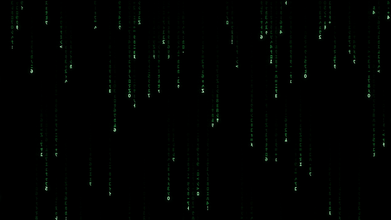

# Matrix Live Wallpaper



Film-accurate Matrix digital rain as a live desktop wallpaper for Linux/X11.
Mirrored half-width katakana, bright white-green head glyphs, exponential
trail fade, per-stream depth dimming, glyph shimmer, and phosphor bloom —
pre-rendered into a seamlessly looping 48-second video, played on a
desktop-layer window that sits *under* your icons and windows.

Because the rain is a pre-rendered H.264 loop, the running cost is tiny:
the decode happens on your GPU's video engine and the simulation cost was
paid once at render time (~0.5% CPU, ~5% GPU compositing at 4K).

## Install

From a clone:

```
git clone https://github.com/wowwheaties/matrix-live-wallpaper.git
cd matrix-live-wallpaper
./install.sh
```

Or from a release tarball (see Releases):

```
tar xzf matrix-live-wallpaper-*.tar.gz
cd matrix-live-wallpaper-*
./install.sh
```

No sudo needed — everything installs into your home directory. On GNOME the
installer also sets up a small shell extension that keeps the rain below the
desktop-icons window; it loads after you log out and back in once (or Alt+F2,
`r`, Enter on X11).

## Requirements

- An X11 session (Wayland is not supported yet — pick "Xorg" on the login screen)
- Python 3, GTK 3 and GStreamer GObject bindings, and an H.264 decoder;
  the installer checks these and prints your distro's install command if missing
- Tested on GNOME 45+ (Ubuntu 24.04+); other desktops (XFCE, MATE, Cinnamon, KDE)
  generally work since the window uses the standard DESKTOP window type

## Usage

```
matrix-wallpaper on|off|toggle|status
```

It autostarts at login. Toggle it off before a gaming session if you want
every last watt back.

## Customize the rain

The generator ships with the install (`render_matrix.py` in
`~/.local/share/matrix-wallpaper/`). It needs `numpy`, `Pillow`, a CJK font
(Noto Sans CJK), and `ffmpeg` on your PATH. Interesting knobs at the top of
the file:

| Knob | Default | Meaning |
|---|---|---|
| `SPAWN_RATE` | 0.044 | how often new streams start, per column per frame |
| `MAX_PER_COL` | 2 | stacked streams allowed per column |
| `BLOOM_STRENGTH` | 0.55 | glow intensity (0 = off) |
| `BLOOM_TINT` | green | glow color |
| `W, H` | 3840×1080 | render size (scaled to your screen at playback) |
| `LOOP_SECONDS` | 48 | loop length |

Re-render (a few minutes), then `matrix-wallpaper off && matrix-wallpaper on`:

```
cd ~/.local/share/matrix-wallpaper
python3 render_matrix.py
```

## Uninstall

```
~/.local/share/matrix-wallpaper/uninstall.sh
```

## Troubleshooting

- **Black wallpaper**: missing H.264 decoder — install your distro's
  `gstreamer1.0-libav` / `gstreamer1-libav` / `gst-libav` package.
- **Rain covers desktop icons (GNOME)**: the helper extension isn't loaded
  yet — log out and back in, then check `gnome-extensions info
  matrix-wallpaper-below@matrix-wallpaper`.
- **Nothing appears on Wayland**: expected; log into an X11 session.
- Player log: `/tmp/matrix-wallpaper.log`.
